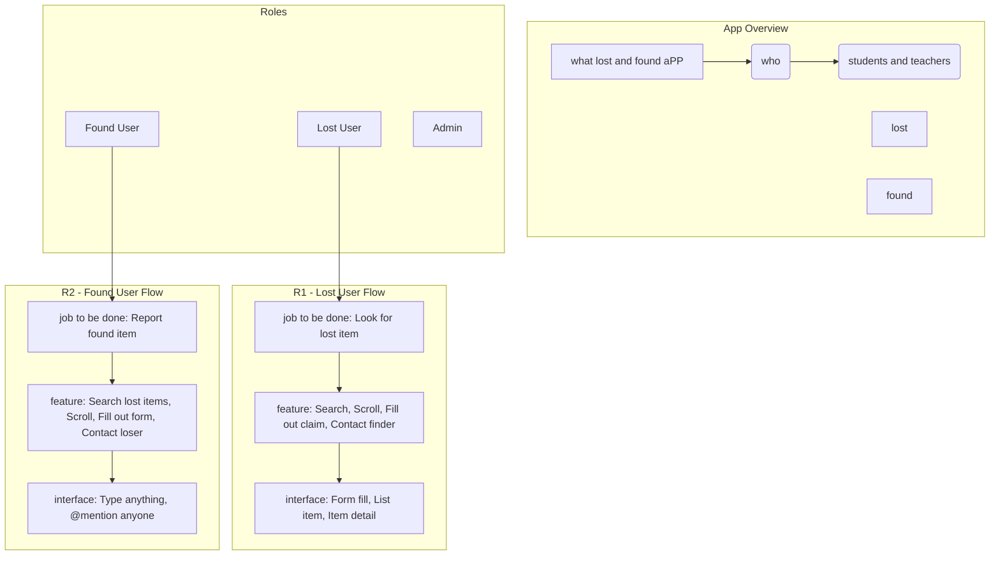

```mermaid  
    flowchart TD ADMIN User Flow (R3)
    subgraph R3Flow["R3 - Admin Flow"]
        Job3["job to be done: Control everything"]
        Feature3["feature: Control, Type anything, @mention anyone"]
        Interface3["interface: Type anything, @mention anyone"]
        R3 --> Job3
        Job3 --> Feature3
        Feature3 --> Interface3
    end
```

```mermaid  
    Detail nodes
    F1_Detail("Scrolling through found items, search, fill out form")
    F2_Detail("Fill out form, scroll through LOST ITEMS, SEARCH")
    F3_Detail("control everything")
    I1_Detail("form fill is when he, list item, item detail")
    I2_Detail("Type anything, @mention anyone")
    I3_Detail("Type anything, @mention anyone")
```

```mermaid  
    Connections based on the visual layout
    D1 --> Job1
    D2 --> Job2
    Job1 --> F1_Detail
    Job2 --> F2_Detail
    Job3 --> F3_Detail
    F1_Detail --> I1_Detail
    F2_Detail --> I2_Detail
    F3_Detail --> I3_Detail
```

```mermaid  
    Add feature and interface boxes to the main feature/interface definitions for clarity
    Feature1 --> F1_Detail
    Feature2 --> F2_Detail
    Feature3 --> F3_Detail
    Interface1 --> I1_Detail
    Interface2 --> I2_Detail
    Interface3 --> I3_Detail

    %% Styling to better match the visual representation
    classDef pink fill:#ffcccc
    class Job1, F1_Detail, I1_Detail pink
    class Job2, F2_Detail, I2_Detail pink
    class Job3, F3_Detail, I3_Detail pink
```
